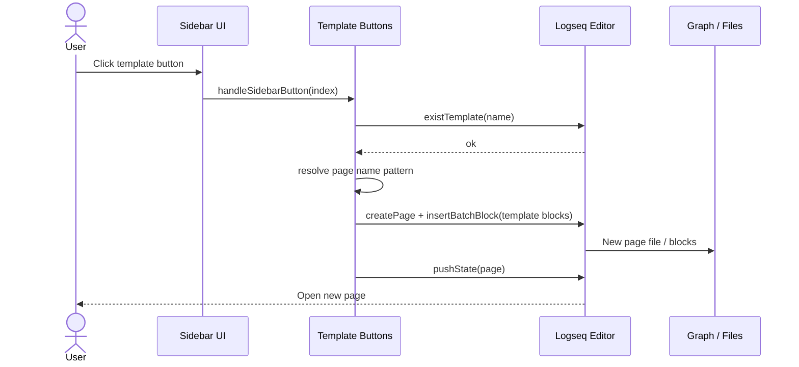
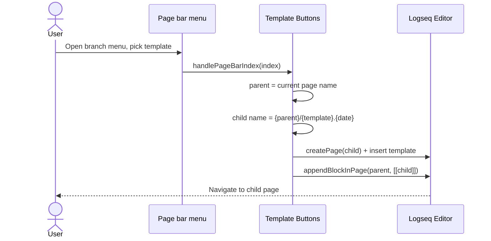
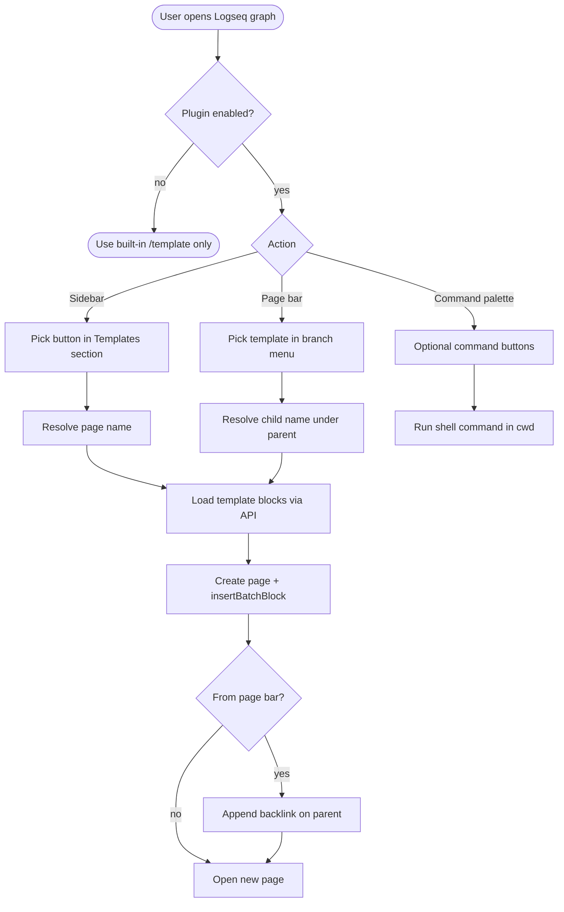

# Logseq Template Buttons


Custom sidebar and page-bar actions to create Logseq pages from your `template::` blocks — including child pages with backlinks on the current article.

Requires **Logseq 0.10+** (tested on desktop builds with the new left sidebar). The plugin uses `effect: true` (runs in the main Logseq context for sidebar DOM and optional shell commands).

## Install

1. Open Logseq **Settings → Plugins → Marketplace**.
2. Search for **Template Buttons** (after marketplace listing is merged).
3. Install and enable the plugin.

Manual install (development):

1. Download the latest release zip from [GitHub Releases](https://github.com/the-homeless-god/logseq-template-buttons/releases).
2. Or clone this repo, run `yarn install && yarn build`, then **Settings → Advanced → Developer mode → Load unpacked plugin**.

## Features

- **Sidebar section** above Favorites — buttons styled like native nav items.
- **Page bar menu** on the current page — create a **child page** from a template and append a backlink on the parent.
- **Template buttons** — insert full template content (respects all blocks under `template::`, including when `template-including-parent:: false`).
- **Command buttons** — run shell commands from a graph-relative `cwd` (desktop; marked with a terminal icon and ▶ badge).
- **JSON configuration** — button list, page name patterns, scope per button (`sidebar`, `page`, `both`).

## Quick start

1. Open plugin settings (**Template Buttons**).
2. Edit **Buttons** JSON (examples below).
3. Reload the plugin if needed.
4. Use the **Templates** block in the left sidebar or the **branch icon** in the page bar.

### Example buttons

```json
[
  {
    "label": "Digitable Blog",
    "type": "template",
    "template": "Digitable.Blog",
    "pageName": "{template}.{date}",
    "scope": "both"
  },
  {
    "label": "Focus time",
    "type": "template",
    "template": "Focus time",
    "scope": "both"
  },
  {
    "label": "Publish blog",
    "type": "command",
    "cwd": "./courses",
    "command": "npm run publish:blog:push",
    "scope": "sidebar"
  }
]
```

## Settings

| Setting | Default | Description |
| --- | --- | --- |
| Section title | `Templates` | Sidebar section header |
| Default page name pattern | `{template}.{date}` | For sidebar template buttons without `pageName` |
| Child page name pattern | `{parent}/{template}.{date}` | For page-bar child creation |
| Add backlink on parent page | `true` | Append `[[child]]` on the parent when creating from page bar |
| Show page bar menu | `true` | Branch icon in the page header |
| Buttons | (see defaults in settings) | JSON array of button definitions |

### Page name tokens

| Token | Meaning |
| --- | --- |
| `{template}` | Template name (`template::` value) |
| `{parent}` | Current page name (page bar only) |
| `{parent-short}` | Last segment of namespace path |
| `{date}` | Date in your Logseq preferred format |
| `{time}` | Current time `HH:mm` |
| `{datetime}` | Date and time combined |

### Button `scope`

| Value | Where shown |
| --- | --- |
| `both` | Sidebar + page bar (default for templates) |
| `sidebar` | Left sidebar only (default for commands) |
| `page` | Page bar only |

## How it works

### Sequence: sidebar template button



### Sequence: child page from page bar



### Flow: user paths



## Command buttons

Command buttons run shell commands from a working directory relative to the graph root.

```json
{
  "label": "Publish blog",
  "type": "command",
  "cwd": "./courses",
  "command": "npm run publish:blog:push"
}
```

If Logseq does not expose the shell API on your version, register the command in `logseq/config.edn`:

```clojure
:commands
[
 ["Publish blog" "cd ./courses && npm run publish:blog:push"]
]
```

Then run it from the Command palette.

## Development

```bash
git clone https://github.com/the-homeless-god/logseq-template-buttons.git
cd logseq-template-buttons
yarn install
yarn dev
```

Load unpacked plugin in Logseq (**Developer mode**), point to this folder. After code changes: `yarn dev`, then **Reload** on the plugin card.

For local graphs, you can add the path to `externals` in `~/.logseq/preferences.json` instead of unpacking.

## Troubleshooting

**Sidebar section missing**

- Confirm Logseq version (new UI uses `.nav-contents-container`, not legacy `.sidebar-contents-container`).
- Reload plugin and restart Logseq.
- Check toolbar fallback icon — if visible, the plugin is loaded.

**First template block missing**

- Fixed in 0.1.0+ by using `insertBatchBlock` instead of `insertTemplate` (Logseq drops the first child when `template-including-parent:: false`).

**Page bar menu empty or clipped**

- Fixed in 0.1.0+ via floating overlay; ensure **Show page bar menu** is enabled.

## License

- [LICENSE](LICENSE) — BSD 3-Clause + commercial use terms (English)
- [LICENSE-RU.md](LICENSE-RU.md) — summary in Russian

Personal and internal non-commercial use is allowed under BSD. **Commercial use** (paid products, SaaS, redistribution for money) requires prior agreement with the author: **Marat Zimnurov** [zimtir@mail.ru](mailto:zimtir@mail.ru).

## Author

Marat Zimnurov — [GitHub](https://github.com/the-homeless-god)

Repository: https://github.com/the-homeless-god/logseq-template-buttons
